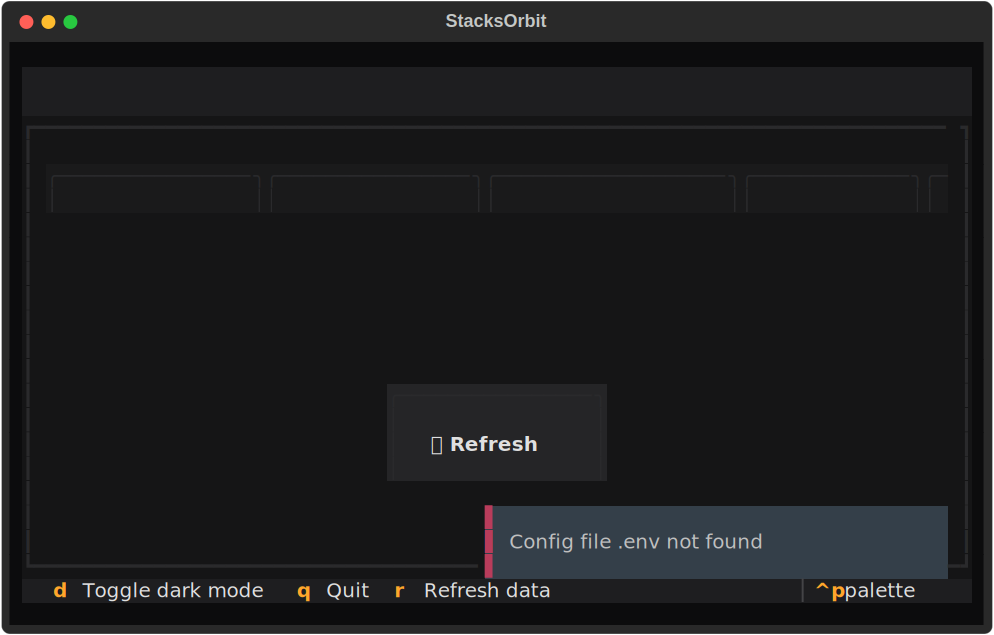

# 🚀 StacksOrbit - Ultimate Deployment Tool

> **The most advanced deployment tool for Stacks blockchain with full CLI capabilities, Hiro API integration, comprehensive monitoring, chainhooks support, and user-friendly experience for everyone.**

**Deploy smart contracts to Stacks blockchain with confidence.**

---

## 📖 Documentation

For a complete guide to developing and using StacksOrbit, please see our new **[Agent Instructions](AGENTS.md)**. This document is the "single source of truth" for all development and deployment information.
